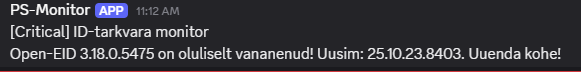
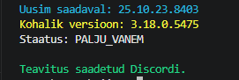

Loodud skript võrdlemaks ID tarkvara versiooni uusima saadaval olevaga ja kasutades webhooki saatmaks tulemus discordi.
Vajalik conf failis sisestada webhook URL.

@{
    WebhookUrl = "https://discord.com/api/webhooks/SINU_WEBHOOK_URL_SIIA"
}

